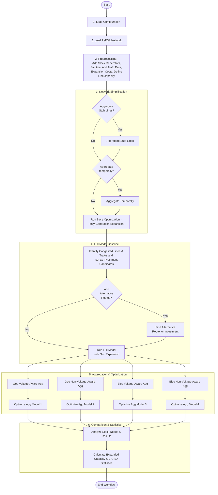

# Voltage Aware Grid Aggregation

This repository contains a Python framework designed to compare different grid aggregation methods within PyPSA (Python for Power System Analysis) networks, with a particular focus on developing and evaluating voltage-aware aggregation strategies. The project provides a structured workflow for loading power system data, performing temporal clustering, running expansion planning simulations, and visualizing the results.

## Features

*   **PyPSA Network Handling:** Load and manage PyPSA network models.
*   **Temporal Clustering:** Reduce the temporal resolution of input data for faster simulations.
*   **Expansion Planning:** Run optimization models for grid expansion using full and aggregated network representations.
*   **Network Visualization:** Generate static and interactive plots of PyPSA networks and simulation results.
*   **Configurable Workflow:** Easily adjust parameters and paths via `config.yaml`.
*   **Modular Design:** Separate modules for data handling, modeling, plotting, and post-processing.
*   **Native PyPSA Aggregation:** Support for built-in PyPSA aggregation methods.
*   **Voltage-Aware Aggregation (In Development):** A dedicated module for implementing and testing novel voltage-aware aggregation techniques.

## Project Structure

```
.
├── config.yaml               # Main configuration file
├── environment.yml           # Conda environment definition
├── main.py                   # Main script to run the aggregation workflow
├── src/
│   ├── __init__.py
│   ├── data_handling.py      # Functions for loading and managing network data
│   ├── model_runner.py       # Manages the execution of PyPSA optimization models
│   ├── plotting.py           # Functions for visualizing networks and results
│   ├── postprocessing.py     # For comparing simulation results
│   ├── temporal_clustering.py # Implements temporal clustering logic
│   └── aggregation/
│       ├── __init__.py
│       ├── pypsa_native.py   # Implements native PyPSA aggregation strategies
│       └── voltage_aware.py  # Placeholder/implementation for voltage-aware aggregation
└── ...                       # Other project files (e.g., .git, .idea, __pycache__)
```

## Process Flow Chart



## Installation

This project uses a Conda environment for dependency management.

1.  **Clone the repository:**
    ```bash
    git clone https://github.com/your-username/Voltage_Aware_Grid_Aggregation.git
    cd Voltage_Aware_Grid_Aggregation
    ```

2.  **Create and activate the Conda environment:**
    ```bash
    conda env create -f environment.yml
    conda activate pypsa-stable
    ```

3.  **Install Gurobi (if not already installed and licensed):**
    The project uses Gurobi as an optimization solver. Please ensure you have Gurobi installed and a valid license configured for your system. If `gurobipy` installation fails during the `conda env create` step, you may need to install Gurobi separately and then install `gurobipy` via `pip` or `conda` after Gurobi is set up. Refer to the Gurobi documentation for installation and licensing instructions.

## Configuration

The `config.yaml` file is central to configuring the workflow. Key parameters include:

*   `pypsa_eur_test_case_path`: Path to the PyPSA-Eur test cases.
*   `results_path`: Directory where all simulation results and plots will be saved.
*   `path_for_temporary_files`: Directory for temporary files.
*   `test_case`: The specific network file (`.nc`) to be used from the `pypsa_eur_test_case_path/networks` directory.
*   `solver_options`: Gurobi solver settings (e.g., `LogToConsole`, `ResultFile`).
*   `temporal_clustering`: Parameters for temporal clustering, such as `n_clusters`.
*   `aggregation_options`: Defines strategies for aggregating different PyPSA components (buses, lines, generators, storage units) using native PyPSA methods.
*   `voltage_aware_options`: Placeholder for configuration specific to voltage-aware aggregation.

**Example `config.yaml` snippet:**

```yaml
pypsa_eur_test_case_path: "C:/BeSt/VA-GA/PyPSA-Eur_v0.7.0"
results_path: "C:/BeSt/VA-GA/results"
path_for_temporary_files: "C:/BeSt/VA-GA/temp"

test_case: "elec.nc"

solver_options: {
                  LogToConsole: 0,
                  ResultFile: 'infeasibility.ilp',
}

temporal_clustering:
  n_clusters: 10

aggregation_options:
  bus_strategies:
    "1": "kmeans"
  line_strategies:
    "1": "length_capacity_weighted_average"
  generator_strategies:
    "1": "sum"
  storage_unit_strategies:
    "1": "sum"

voltage_aware_options: {}
```

## Usage

To run the full workflow, execute the `main.py` script:

```bash
python main.py
```

The script will:
1.  Load the network specified in `config.yaml`.
2.  Generate static and interactive plots of the initial network.
3.  Perform temporal clustering.
4.  Run expansion planning on the full, temporally clustered model.
5.  (Future/Commented out functionality) Run aggregation using native PyPSA methods and voltage-aware methods, and compare results.

Outputs, including plots and simulation results, will be saved to the `results_path` specified in `config.yaml`.

## License

This project is licensed under the MIT License. See the LICENSE file for details (if available).
